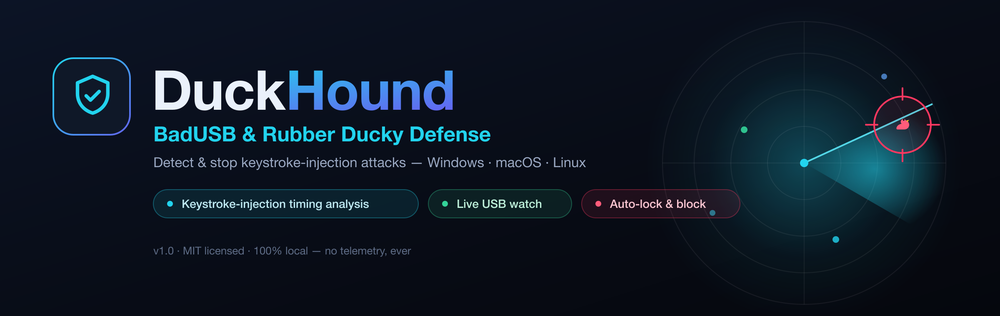
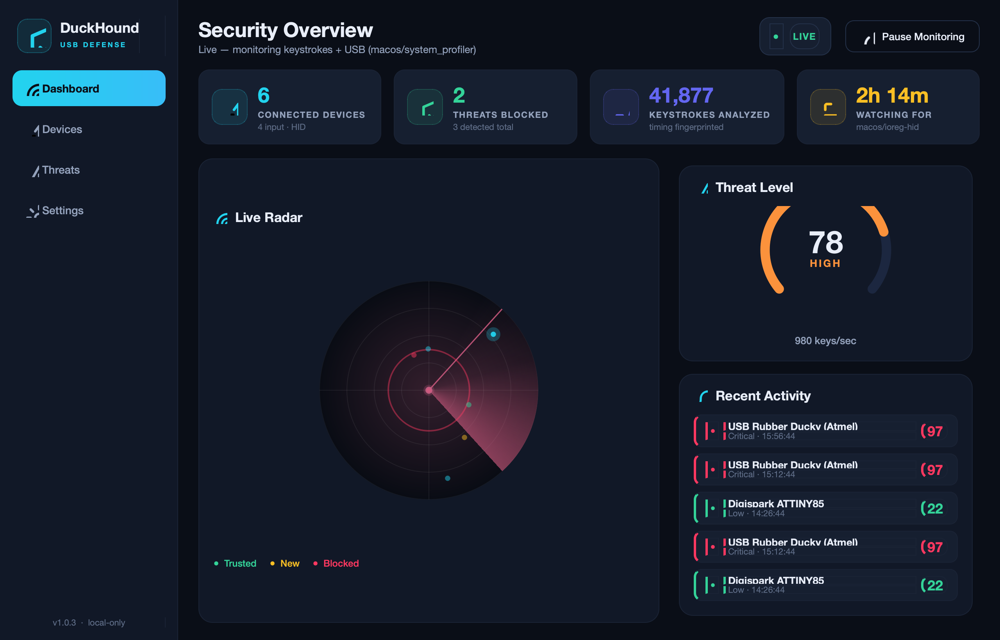
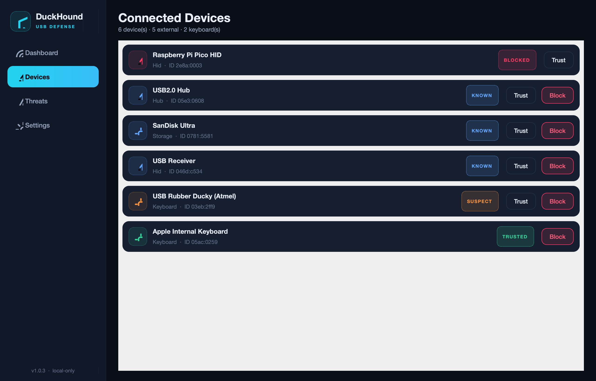
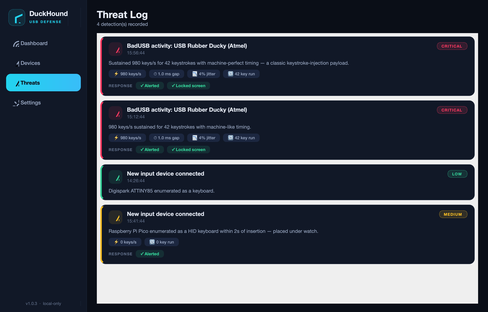
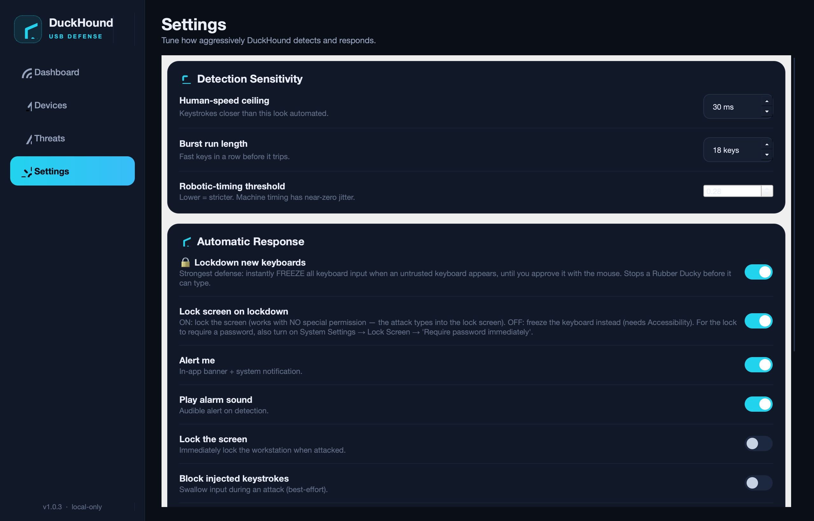
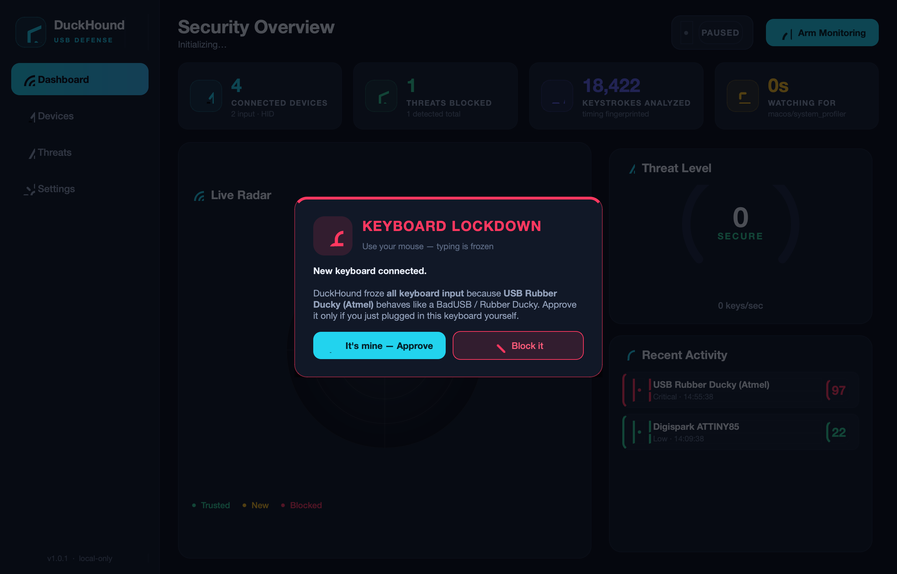

<div align="center">



<h1>🛡️ DuckHound</h1>

**Detect and stop BadUSB / Rubber Ducky keystroke-injection attacks — beautifully, on every OS.**

[](https://github.com/at0m-b0mb/DuckHound/actions/workflows/ci.yml)
[](#-installation)
[](https://www.python.org)
[-41CD52?style=flat-square&logo=qt&logoColor=white)](https://doc.qt.io/qtforpython/)
[](LICENSE)
[](#-privacy)

</div>

---

## What is a Rubber Ducky / BadUSB?

A **Rubber Ducky** (and BadUSB devices like Digispark, Flipper Zero, or a re-flashed
thumb drive) looks like an ordinary USB stick — but it tells your computer it's a
**keyboard**. The moment it's plugged in, it "types" a pre-loaded payload at
**hundreds to thousands of keystrokes per second**: opening a terminal, pasting a
reverse shell, exfiltrating files, all in under a second.

Because it *is* a keyboard as far as the OS is concerned, antivirus rarely stops it.

**DuckHound catches it by how it types.** No human types 500 keys per second with
robotic, jitter-free timing — so DuckHound watches the keystroke stream, fingerprints
that signature, and slams the door shut.

---

## ✨ Highlights

- 🔒 **Lockdown mode** — the instant an untrusted keyboard appears (or an injection burst
  is seen), DuckHound **freezes all keyboard input** and demands you approve it *with the
  mouse*. A Rubber Ducky can't type its way out.
- 🎯 **Keystroke-injection detection** — a real-time timing engine that scores every
  burst of input on *speed* and *regularity*. Flags machine typing; ignores even the
  fastest human.
- 🔌 **Live USB / HID watch** — enumerates connected devices on Windows, macOS and
  Linux and correlates a brand-new "keyboard" with an instant typing burst (the
  classic Ducky tell).
- 🚨 **Active response** — alert, sound the alarm, **lock the screen**, swallow injected
  keystrokes, or flag the rogue device for de-authorization. You choose how aggressive.
- 📡 **A gorgeous SOC dashboard** — animated radar, live threat meter, device roster and
  a full forensic threat log. Dark, fast, and hand-painted in Qt.
- 🖥️ **Truly cross-platform** — one Python codebase, native enumeration backends per OS,
  graceful degradation when a backend or permission isn't available.
- 🔒 **100% local** — DuckHound measures keystroke **timing only** (never *which* keys),
  and sends nothing off your machine. No accounts, no cloud, no telemetry.
- 🧰 **GUI + headless CLI** — run the dashboard, or guard a kiosk/server from the terminal.

---

## 📸 Screenshots

<div align="center">

### Dashboard — live radar, threat meter & activity feed


### Devices — every connected device, trust or block in one click


### Threat Log — every detection with the timing evidence behind it


### Settings — tune sensitivity & automatic responses


### 🔒 Lockdown — keyboard frozen, approve with the mouse or it stays locked


</div>

> _These are real screenshots, rendered straight from the app
> (`scripts/capture_screenshots.py`)._

---

## 🚀 Installation

> Requires **Python 3.9+**.

```bash
# 1. Clone
git clone https://github.com/at0m-b0mb/DuckHound.git
cd DuckHound

# 2. Create a virtual environment
python3 -m venv .venv
source .venv/bin/activate          # Windows: .venv\Scripts\activate

# 3. Install
pip install -r requirements.txt
```

### Platform notes

| OS | USB backend | Extra steps |
|----|-------------|-------------|
| **macOS** | `system_profiler` (built-in) | Grant **Input Monitoring** to your terminal/Python in *System Settings → Privacy & Security* so the keystroke hook can run. |
| **Linux** | `sysfs` (built-in); `pyudev` optional | For screen-lock / de-authorization responses, the user must be able to run `loginctl`. |
| **Windows** | PowerShell `Get-PnpDevice` (built-in) | Run as Administrator for device de-authorization. `pip install wmi pywin32` for richer queries (optional). |

---

## ▶️ Usage

```bash
python run.py            # launch the dashboard
python run.py --demo     # dashboard with a simulated attack feed — no permissions needed
python run.py --cli      # headless terminal monitor (servers, kiosks, SSH)
```

**Try it safely:** `python run.py --demo` stages realistic Rubber Ducky attacks every
few seconds so you can watch the radar light up, the meter spike, and the response fire
— without any real device or OS permission.

---

## 🩺 Troubleshooting — "it didn't detect my Rubber Ducky!"

> ### ⚡ Fastest way to actually neutralize a Ducky (works with **no permissions**)
> DuckHound spots a new keyboard via `ioreg` (no permission needed) and **locks your
> screen**, so the injected payload types harmlessly into the lock screen. To use it:
> 1. **Settings → Automatic Response →** keep **Lockdown new keyboards** and **Lock
>    screen on lockdown** ON (both default).
> 2. Turn on **System Settings → Lock Screen → "Require password… immediately"** so the
>    lock demands your password.
> 3. Arm monitoring, then plug in the Ducky — your screen locks within ~1 second.
>
> For DuckHound to also *detect by typing speed* and *freeze* the keyboard, grant the
> permissions below. But the lock-screen defense above needs none of them.

---

> Detection-by-typing is **99% an OS permission** issue. The global keyboard hook needs
> permission to see keystrokes — without it, the OS silently delivers **zero** events
> and DuckHound is flying blind. **Run the self-test first:**
>
> ```bash
> python scripts/diagnose.py
> ```
> It checks permissions, the USB backend, and does a live 6-second capture so you can
> *see* whether the hook is receiving input.

**1. Are you in `--demo` mode?** Demo mode uses a *simulated* feed and ignores real
keystrokes by design. Use plain `python run.py` to watch real input.

**2. Grant keyboard-monitoring permission (the big one):**

| OS | What to grant |
|----|---------------|
| **macOS** | *System Settings → Privacy & Security* → enable **Input Monitoring** *and* **Accessibility** for the app you launch DuckHound from (Terminal, iTerm, VS Code…). Then **fully quit and relaunch** that app. DuckHound now shows a yellow banner with a **Grant Access** button when this is missing. |
| **Linux** | Use an **X11** session (Wayland restricts global key capture), or run with access to `/dev/input`. |
| **Windows** | Works out of the box; run as Administrator only for device de-authorization. |

**3. Make it actually _stop_ the attack.** Open **Settings → Automatic Response**:
- **🔒 Lockdown new keyboards** *(on by default, strongest)* — the moment an untrusted
  keyboard appears, **all** keyboard input is frozen and a mouse-only dialog asks you to
  Approve or Block. Nothing types until you decide. (Only devices plugged in *after* you
  arm monitoring trigger this — your existing keyboard is fine.)
- **Lock the screen** — on macOS this uses the screensaver, so also turn on
  *System Settings → Lock Screen → "Require password immediately"*.
- **Block injected keystrokes** — swallows input for ~2s to kill the rest of the payload.

**4. Flipper Zero notes.** A Flipper running a BadUSB/DuckyScript payload enumerates as a
USB keyboard and types far faster than a human — once permission is granted it trips the
detector within ~18 keystrokes. If your script uses large per-key `DELAY`s, lower the
**Human-speed ceiling** in Settings to widen the net.

---

## 🧠 How detection works

A Rubber Ducky betrays itself in two ways at once. DuckHound scores a rolling window of
keystrokes on both:

| Signal | Human | Rubber Ducky |
|--------|-------|--------------|
| **Speed** (keys/sec) | ~6–12, bursts to ~15 | **200–3000+** |
| **Regularity** (timing jitter) | High — hands are noisy | **Near zero** — machine-perfect |
| **Onset** | Types whenever | Often **within ~2s of being plugged in** |

```
score = 0.45·speed  +  0.25·regularity  +  0.30·sustained-run
```

An alert fires only when input is **both** superhumanly fast **and** sustained — so a
fast human typist or a held-down key won't trip it, while a 19-keystroke injection burst
will. A keyboard that appears and *immediately* starts typing is escalated to
**critical**. Full write-up in **[docs/HOW_IT_WORKS.md](docs/HOW_IT_WORKS.md)**.

Tune any of it live in **Settings**:

- **Human-speed ceiling** — keystrokes closer together than this look automated.
- **Burst run length** — how many fast keys in a row before it trips.
- **Robotic-timing threshold** — lower is stricter on machine-like regularity.

---

## 🛠️ Project structure

```
DuckHound/
├── run.py                     # launcher (GUI / --cli / --demo)
├── duckhound/
│   ├── app.py                 # GUI entry point
│   ├── cli.py                 # headless terminal monitor
│   ├── config.py              # persisted settings
│   ├── core/
│   │   ├── keystroke.py       # ⭐ the timing-analysis detector
│   │   ├── engine.py          # orchestrates monitors, scoring & response
│   │   ├── backends/          # per-OS device enumeration (mac/linux/windows)
│   │   ├── responder.py       # lock / notify / block actions
│   │   ├── simulator.py       # synthetic attack feed for demo & tests
│   │   └── models.py          # Device / ThreatEvent data models
│   └── ui/
│       ├── theme.py           # palette + global stylesheet
│       ├── main_window.py     # shell wiring engine ↔ pages
│       ├── components/        # radar, threat meter, toggle, cards, toast…
│       └── pages/             # dashboard · devices · threats · settings
├── scripts/capture_screenshots.py
└── assets/                    # banner, logo, screenshots
```

---

## 🔒 Privacy

DuckHound never records **which** keys you press — only the **time between**
keystrokes. There is no logging of content, no network access, and no telemetry.
Everything stays on your device.

---

## 🗺️ Roadmap

- [ ] Real-time `pyudev` hotplug events on Linux (sub-second device arrival)
- [ ] System-tray background guard with autostart
- [ ] Per-device USB allow-listing that survives reboots
- [ ] Optional keystroke *suppression* during a confirmed attack on all platforms
- [ ] Signed installers (`.dmg`, `.msi`, AppImage)

---

## ⚠️ Disclaimer

DuckHound is a **defensive** security tool for protecting machines you own or are
authorized to protect. The bundled simulator generates *synthetic* attacks only — it
contains no payloads and cannot attack anything.

---

## 📄 License

MIT © [at0m-b0mb](https://github.com/at0m-b0mb) — see [LICENSE](LICENSE).

<div align="center">
<sub>Built with 🛡️ for everyone who's ever side-eyed a USB stick they found in the parking lot.</sub>
</div>
